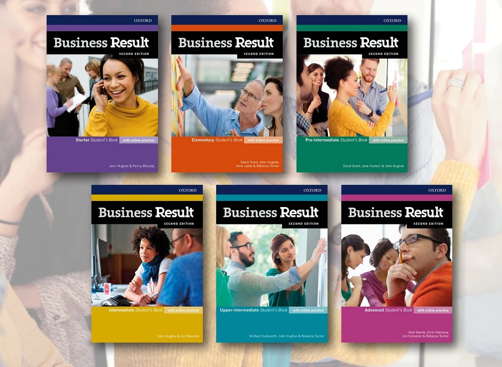

+++
title = "课程类型"
image = "notebook-laptop.jpg"
featured_image = "notebook-laptop.jpg"
weight = 1
+++

商务英语课程

我提供一对一的商务英语课程，旨在帮助职场人士在工作中更清晰、更自信地进行沟通。

我的学生通常来自IT、医疗、工程等行业，在这些领域中，英语对于会议、邮件和日常沟通非常重要。

---

## 课程如何进行

每节课45分钟，完全根据您的需求进行个性化设计。

我们通常使用 Business Result 教材，该教材专注于真实职场英语，有助于建立清晰的学习结构并实现稳定进步。

在第一节课中，我们可能会更多关注自然表达和评估您的当前水平，然后再深入教材学习。

---

## 课堂内容

在课堂上，您将会：

- 用英语进行表达并回答问题
- 学习实用的商务词汇和表达方式
- 练习真实工作场景（会议、邮件、讨论）
- 在表达过程中及之后获得纠正
- 获得如何提高英语水平的反馈

我不会在每个错误出现时立即打断您，而是做笔记并在适当的时候提供清晰的纠正，让您能够更自由地表达。

每节课后，您都会在个人学习表中收到更新，包括课堂中的重要词汇和纠正内容。该文档会持续使用，帮助您逐步积累词汇。

---

## 学习材料

我们使用 Business Result 系列教材，引导您从当前水平提升到高级商务沟通能力。

  

---

## 下一步

您可以[联系我](/post/contact)，或查看[价格页面](/post/pricing/)了解更多信息。